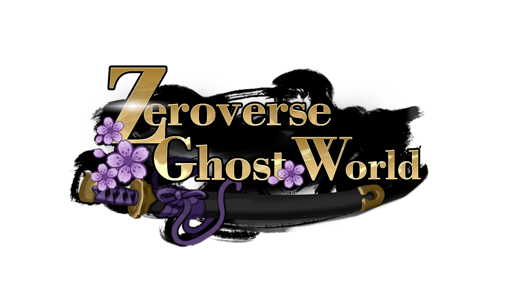
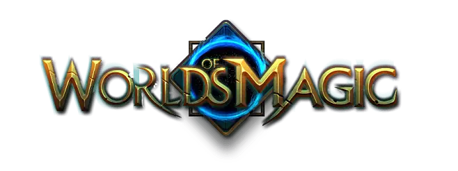
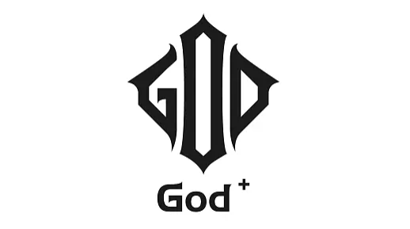

# 👏 歡迎來到零世界-Zeroverse

歡迎來到零世界-Zeroverse，百萬Zeroverse玩家為愛重來，共創新一代財富密碼！\
Zeroverse曾在日本及東南亞地區坐擁百萬遊戲玩家，是全球首款曾登頂日本免費榜的遊戲改編鏈遊！

Zeroverse是一個包含多元宇宙的區塊鏈遊戲，將NFT，DeFi與遊戲深度結合，為用戶創造了不止一個遊戲所組成的多元宇宙世界。 玩家通過召集英雄進入不同的宇宙進行冒險，除了第一個百鬼子世界之外，未來還有魔法世界、眾神世界以及多個未知世界。 深耕區塊鏈遊戲玩法，讓用戶免費玩，輕鬆賺的同時：

1. 無門檻：誠邀任意遊戲玩家，免費贈送永不銷毀可以產幣的NFT；
2. 可持續：NFT可用於所有Zeroverse生成的宇宙；
3. 回本無憂：除了ZVC外，還能免費獲得可以在GW平台購買盲盒的USDW；
4. 借助區塊鏈實現公平透明的NFT資產獲取與確權，並且無需花錢也可以獲得虛擬貨幣；
5. 適合各種類型的用戶，喜歡遊戲的用戶能和百萬遊戲玩家一起共享遊戲的樂趣，不喜歡玩遊戲的用戶也可以通過活躍任務獲得虛擬貨幣；
6. Zeroverse是掛機類的RPG遊戲，讓玩家僅利用碎片時間即可獲得良好的遊戲體驗和成長；
7. 遊戲上陣陣容多達25個角色，與同類遊戲上陣5人不同，玩家獲得的角色都能發揮作用；
8. 完整成熟的遊戲經濟模型，保障遊戲的長期穩定運行；
9. 玩家參與共建與治理的遊戲社區，深度參與遊戲的發展；


為了確保Zeroverse能滿足玩家們不斷變化的需求，本文檔會根據產品迭代而更新。


## 產品矩陣

### Zeroverse-Ghost World

<figure><figcaption>
Zeroverse的第一個子世界-Ghost World，是一個充滿日式復古風格的百鬼世界
</figcaption></figure>

### Zeroverse-Magic World

<figure><figcaption>
Zeroverse的下一個子世界也許會是Magic World，這將充滿魔法的元宇宙（暫未開放）
</figcaption></figure>

### Zeroverse-Gods World

<figure><figcaption>
Zeroverse的另一個子世界是Gods World，我們能遇見你未曾想到過的眾神宇宙（暫未開放）
</figcaption></figure>
