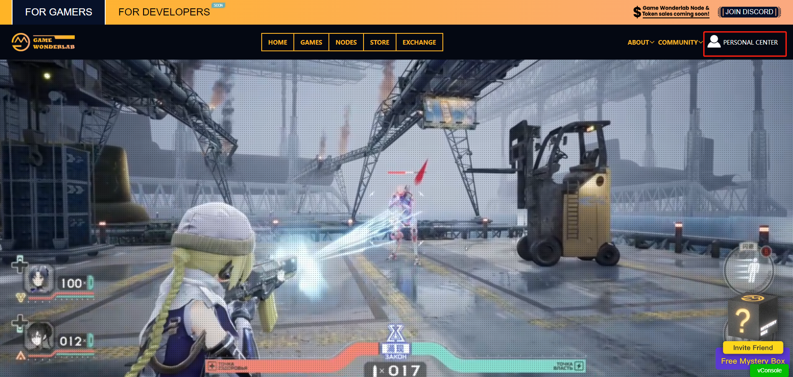
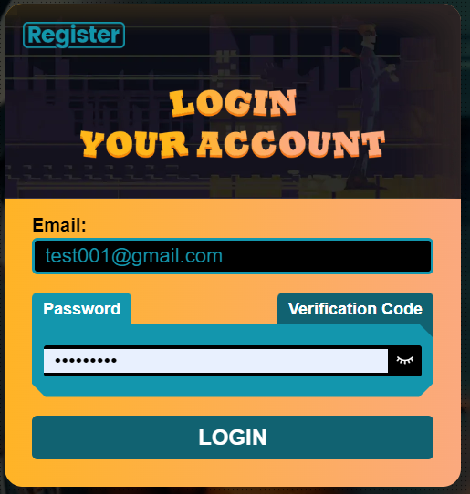
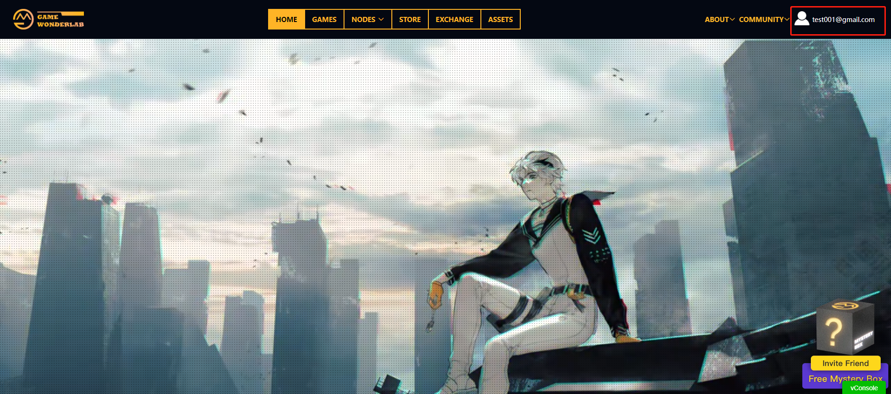
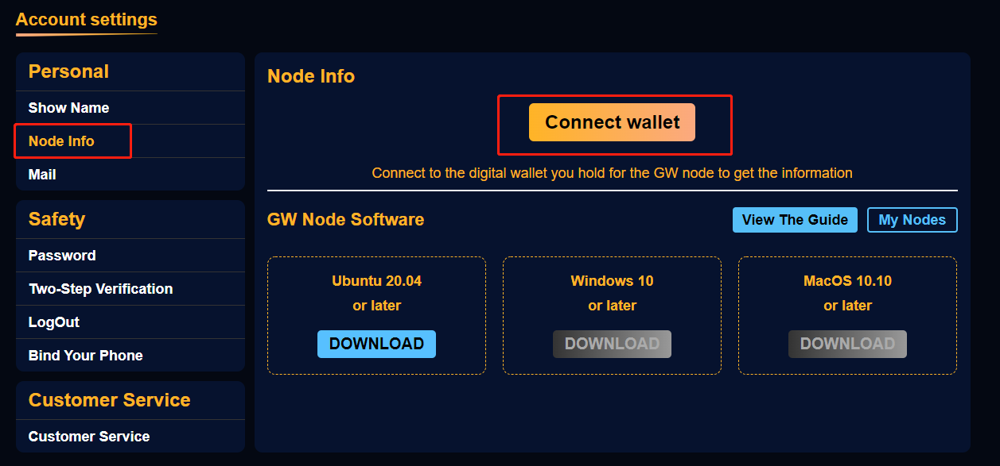

# 綁定錢包

如果你已經註冊了GW的賬號，並且已經創建了錢包，那就可以在GW平台綁定您的錢包了

1. 進入GW平台，地址：gamewonderlab.io
2. 然後點擊右上角的**PERSONAL CENTER**

<figure><figcaption></figcaption></figure>

3\. 接著輸入您的賬號和密碼，當然也可以通過郵箱驗證碼的方式登錄。

<figure><figcaption></figcaption></figure>

4\. 登錄成功後，點擊右上角自己的賬號，進入個人信息界面。

<figure><figcaption></figcaption></figure>

4\. 然後在頁面左邊，選擇**Node Info** 然後再點擊**Connect Wallect** 按照提示操作即可

<figure><figcaption></figcaption></figure>

\
