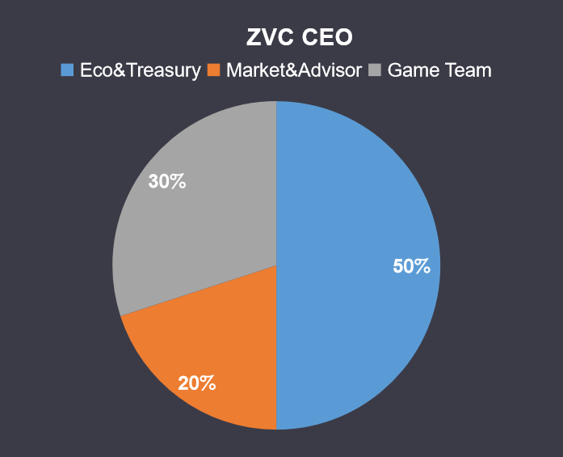

# 🪙 生態通證：ZVC

Zeroverse Coin(ZVC)是Zeroverse的经济模型中的重要组成部分，它是對为游戏开发做出贡献的玩家奖励，也能更好的讓大家體驗遊戲。

## 通證詳情

* **代号：**ZVC
* **总量：**10,000,000,000
* **合约地址：**0x8f76907B173FBf65ddd84A86519C8767a90b8B90

## 通證分配

<figure><figcaption></figcaption></figure>

## 流通狀態

為保障ZVC的健康流通，同時也為了在某些時期以避免市場崩潰為目的釋放一些ZVC，我們給ZVC設定了三種流通狀態：

鎖定：鎖定期無法進行交易，購買或者撤回&#x20;

等待：等待期無法進行交易和購買，可撤回&#x20;

解鎖：解鎖期可以自由進行交易，購買以及撤回
