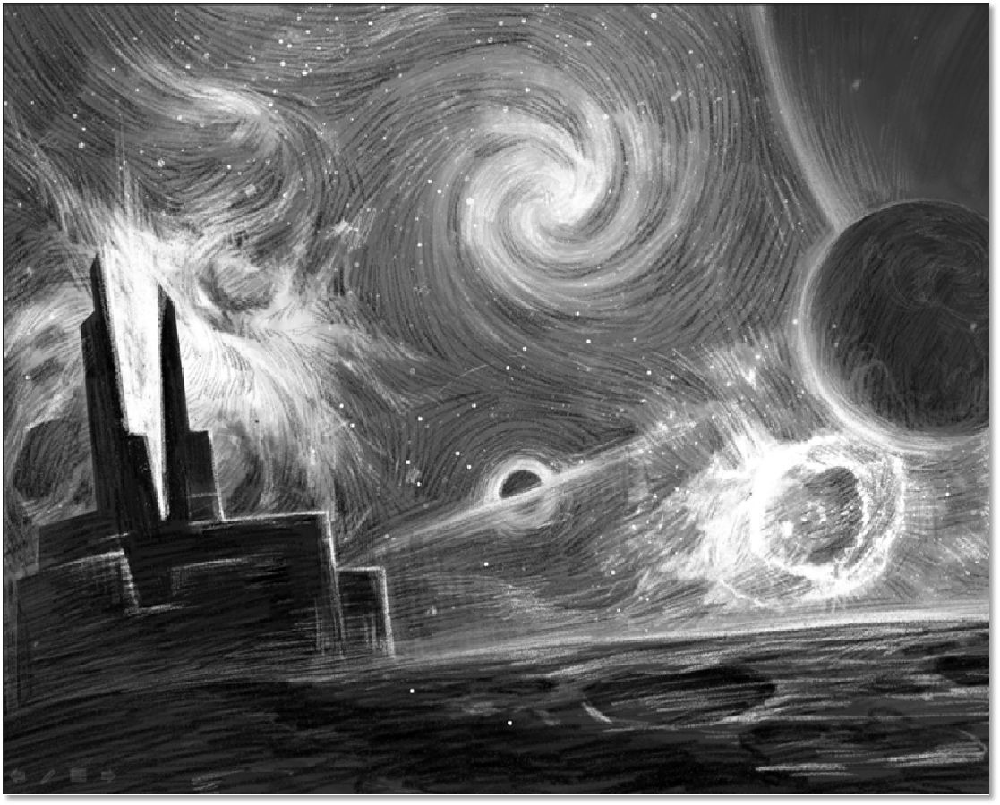
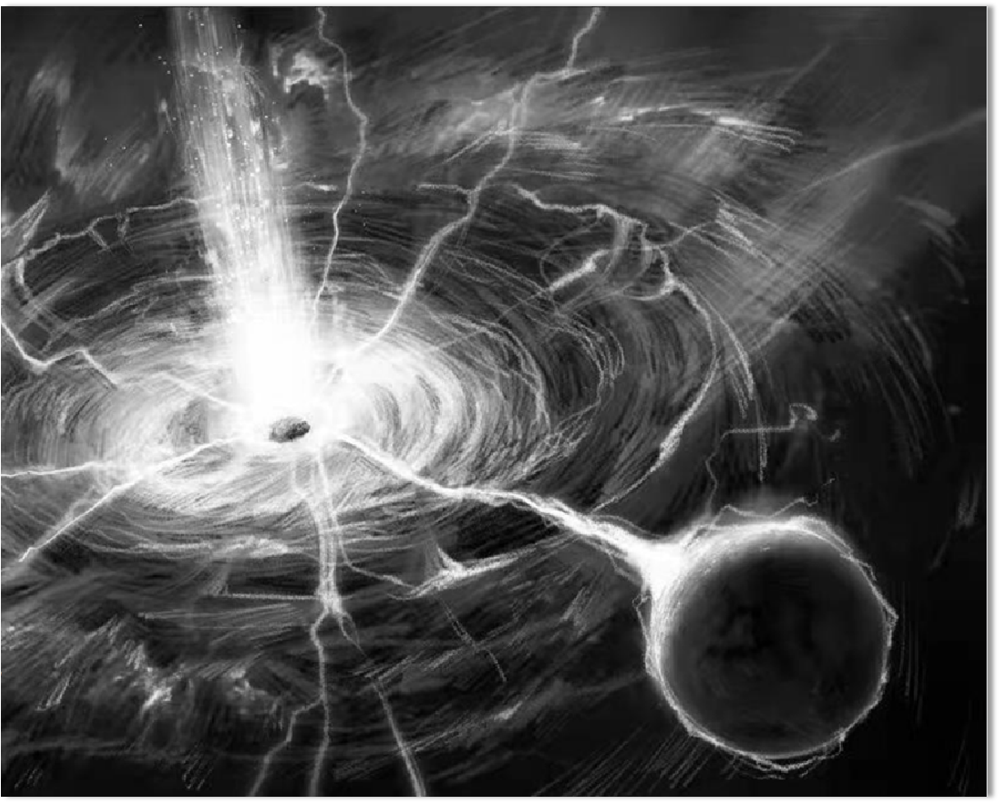
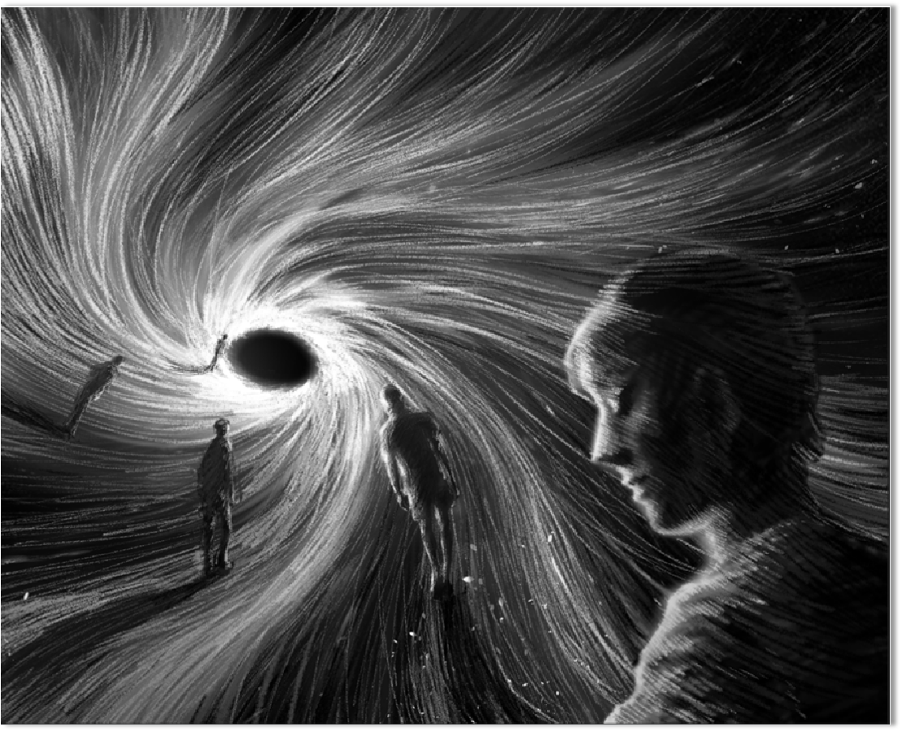

# 故事背景

龐大的宇宙群中，有一個永恆且超然存在的空間，叫Zeroverse。 Zeroverse是整個宇宙群的中心，在它的周圍，一層層地伴生分佈著各種各樣的平行宇宙空間，每個宇宙空間都孕育著屬於自己的文明時空，我們一般把這些文明時空稱為子世界，而把Zeroverse稱為母世界。 Zeroverse用自己穩定且無限的能量維持著無數子世界之間的平衡和獨立。

<figure><figcaption></figcaption></figure>

突然有一天，Zeroverse內部發生了變故，能量紊亂了，由此導致子世界之間的時空壁膜變得非常不穩定，紛紛被撕裂開，形成了無數條連接Zeroverse的時空之門，由此開始，不同的子世界通過Zeroverse為中轉站互相對接，產生了文明的交彙和衝突，宇宙的秩序變得無比混亂。

<figure><figcaption></figcaption></figure>

此刻，身為時空穿梭者的我們需要和其他人一起進入各種子世界收集資源，修復Zeroverse，使它的核心能量重歸穩定，並以此讓紊亂的各種時空恢復正常，回歸初始的秩序。來吧，各位時空穿梭者，這是屬於你們的時刻！ ！ !

<figure><figcaption></figcaption></figure>
