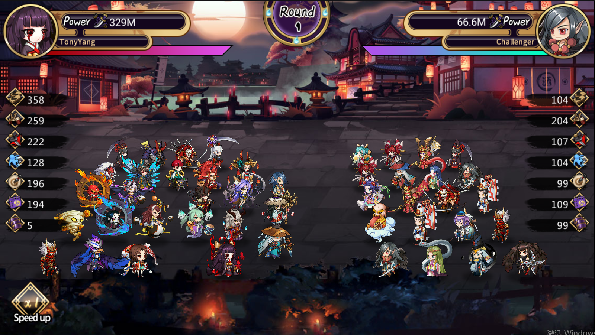

# 核心戰鬥

遊戲完整的上陣陣容為25人戰鬥+10人援助陣容，上陣位置根據遊戲內主線推圖的進度依次解鎖；

NFT角色和免費角色能夠混合在同一套陣容內上陣，也能在援助位上陣；&#x20;

每一回合，速度高的一方先進行整體攻擊，如果判定某個角色釋放技能，則該回合的攻擊則被該角色的技能公司所替代，NFT角色擁有更好的屬性和更高機率的技能。

<figure><figcaption></figcaption></figure>
