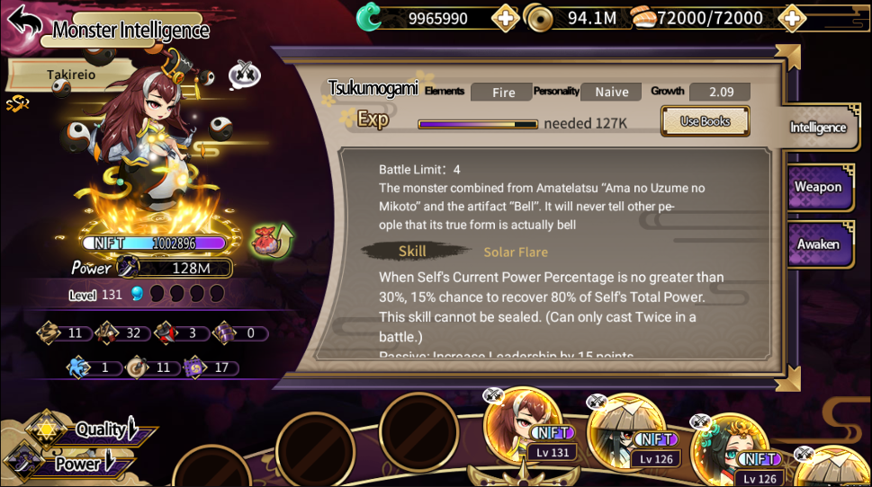

# 角色屬性

角色分為免費角色和NFT角色；

所有角色均包含7大基礎屬性

——生命，速度，暴擊，防禦，閃避，威壓，韌性&#x20;

生命：角色戰鬥的血量，同時攻擊力也是用生命力換算&#x20;

速度：角色每回合出手的優先級&#x20;

暴擊：角色觸發暴擊傷害的能力&#x20;

防禦：角色減免直接傷害的能力&#x20;

閃避：角色直接躲閃攻擊的能力&#x20;

威壓：角色對低於自己威壓的敵方戰鬥壓制的能力&#x20;

韌性：角色按比例免除總傷害的能力

**NFT角色還有額外的Earnpower屬性，決定了你的魂石產出量，以及每日可以分得的ZVC數量**

<figure><figcaption></figcaption></figure>
