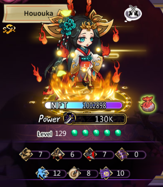
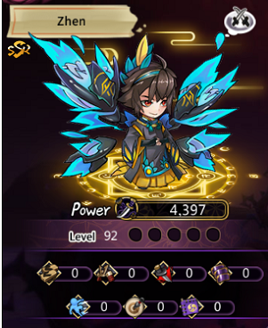

# 普通角色和NFT角色區別

## NFT角色

1. 能夠進入能量石礦進行駐守，駐守後持續挂機獲取魂石；
2. 基礎屬性高於普通角色；
3. 消耗資源培養能夠大量提升NFT的屬性以及EarnPower；
4. 可參與特殊遠征玩法；
5. 可以參與領地爭奪玩法（暫未開放）。

<figure><figcaption></figcaption></figure>

## 普通角色

1. 無法進入能量石礦進行駐守，無法獲取魂石；
2. 基礎屬性低於NFT角色；
3. 消耗資源培養只能提升基礎屬性；
4. 無法參與特殊遠征玩法；
5. 無法參與領地爭奪玩法（暫未開放）。

<figure><figcaption></figcaption></figure>
